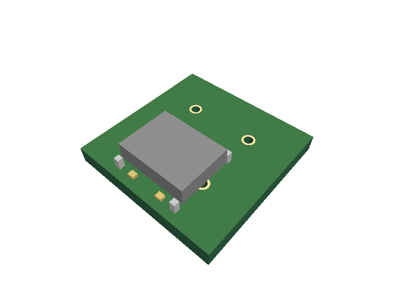
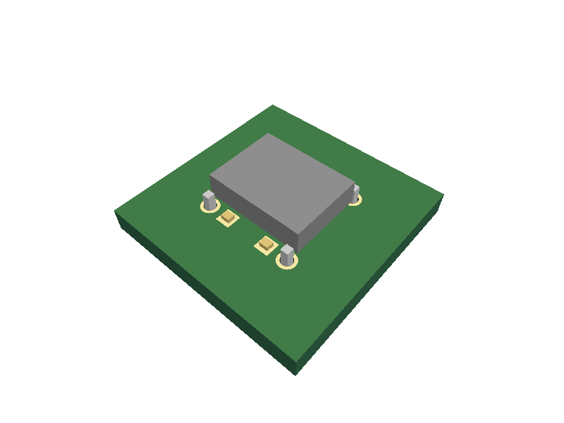

# Hybrid OBJ origin: deeper legs move unchanged SMD contacts

This reproduction builds a new circuit from TSX and two small, synthetic OBJ
fixtures. It isolates the origin-inference question from PR #189 without using
the old flashlight Circuit JSON, a registry build, or a downloaded model.
There are no production-code changes.

## What changes

The connector has two SMD contacts and four through-hole mounting legs. Both
models use millimeters, +Z up, a PCB mating plane at Z=0, and an XY origin at
(0,0). Their complete XY bounds are centered at (0,0). The footprint places
SMD pads at (±1.5,3) and mounting holes at (±3,±3).

In the control, all four legs end at Z=-1. In the second model, only the two
legs at Y=-3 extend to Z=-2. The housing, SMD contacts, XY coordinates, material
assignments and faces are unchanged. A test verifies that exactly eight
vertices change, and only their below-board Z coordinate changes.

The expected SMD-to-pad alignment follows directly from these authored
coordinates; it is not derived from the exporter's origin calculation.

## Observed result on upstream e44c885 (0.0.123)

At top-side rotation 0°, the right SMD contact should touch the PCB at
(1.5,3,0.8). The 1.6 mm board is centered on Z=0, so its top is Z=0.8.

| Case | SMD contact Y | Pad Y | XY error |
| --- | ---: | ---: | ---: |
| Equal-depth legs, inferred origin | 3 mm | 3 mm | 0 mm |
| Deeper negative-Y legs, inferred origin | 6 mm | 3 mm | 3 mm |
| Same deeper legs, explicit model origin (0,0,0) | 3 mm | 3 mm | 0 mm |

`getBoardContactBounds` in `lib/utils/cad-mesh-placement.ts` selects the
lowest vertices of the entire mesh. In the deeper-leg model, those vertices
belong only to the two negative-Y leg tips. Their XY center is (0,-3), even
though the footprint and mating-plane center remain (0,0).
`getInferredMeshOrigin` uses that tip center for
`center_of_component_on_board_surface`, shifting the unchanged SMD contacts
by 3 mm. In Scene3D the up axis is +Y; this Circuit-Y displacement is along
Scene3D Z. The test applies the exporter's actual box rotation and compares
the resulting contact point with the independently generated PCB pad.

The explicit-origin control uses the very same deeper-leg model. It establishes
that this geometry can align correctly without moving the footprint or changing
the component's position.

## Run

```sh
bun test tests/repro/hybrid-obj-origin.test.tsx
REPRO_STRICT=1 bun test tests/repro/hybrid-obj-origin.test.tsx
```

The normal run marks the eight known broken alignment cases with `test.failing`.
The strict run executes them as ordinary tests and exposes the failures. Model
loading and input validation happen outside `test.failing`, so a missing model
cannot masquerade as an expected failure. Both controls are ordinary passing
tests, covering 0°, 90°, 180° and 270° on both PCB layers. All assets are local.

The three snapshots characterize current behavior, including the misplaced
model. They are not golden images of desired behavior. When fixing the bug,
remove the expected-failure designation and update the misplaced snapshot only
after visually checking it.

## Scope

This proves that default hybrid-model alignment depends on below-board leg
depth. It does not establish that a fresh C165948 EasyEDA import is broken:
the current importer supplies an explicit `modelOriginPosition`, which bypasses
this inference. Nor does this test justify preserving the raw origin of every
OBJ file. A general fix still needs to respect model-origin conventions.

## Same-camera snapshots

Equal-depth control:


Only negative-Y leg tips extended: the whole model shifts sideways.



The same extended model with an explicit (0,0,0) model origin:


